# Aplikasi CRUD Barang dengan Firebase & Awesome Notifications

---
## Fitur Utama

* **Autentikasi Pengguna**: Login & Register menggunakan Firebase Authentication.
* **Manajemen Barang (CRUD)**: Tambah, lihat, ubah, dan hapus data barang, disimpan di Firebase ().
* **Notifikasi**: Notifikasi untuk setiap aksi penting menggunakan Awesome Notifications.

---
## Galeri Aplikasi

Berikut adalah beberapa cuplikan tampilan aplikasi dan notifikasinya:

**1. Halaman Registrasi & Login Pengguna**

  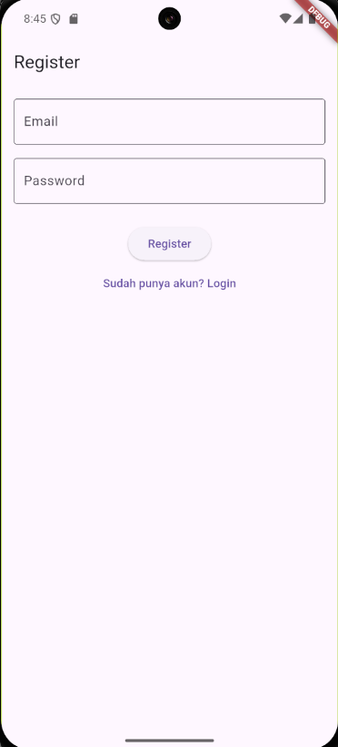
   
  <em>Tampilan untuk pengguna baru mendaftarkan akun.</em>

  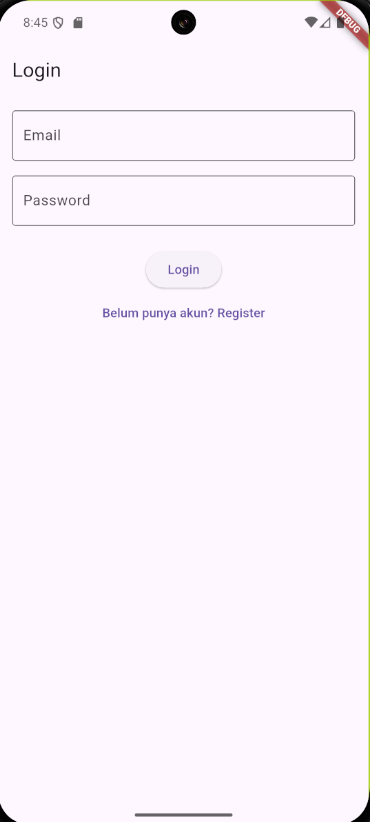
   
  <em>Tampilan untuk pengguna masuk ke aplikasi.</em>

**2. Proses Autentikasi & Notifikasinya**

  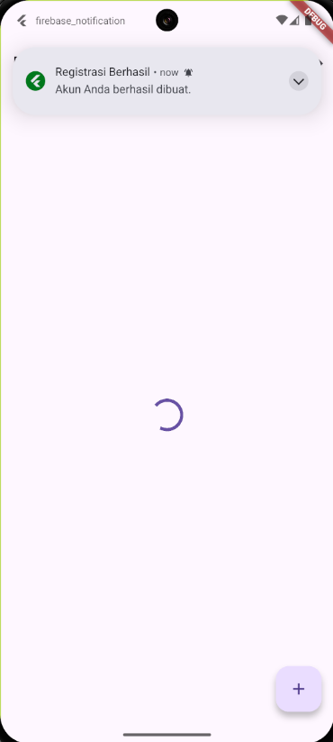
   
  <em>Notifikasi yang muncul setelah registrasi berhasil.</em>

  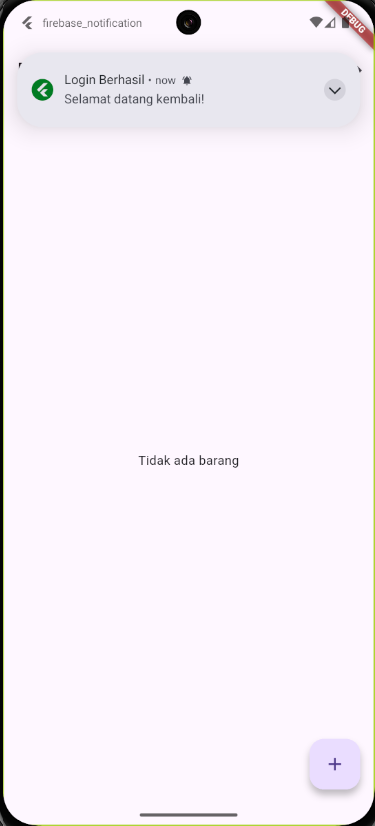
   
  <em>Notifikasi yang muncul setelah login berhasil.</em>

  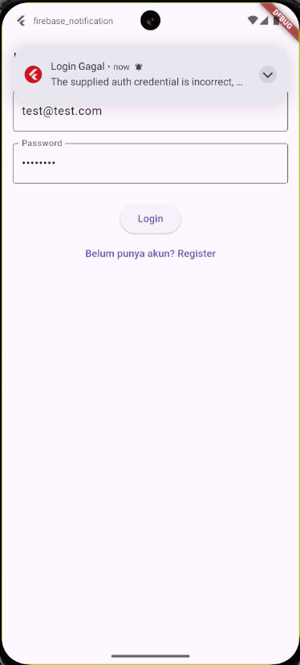
   
  <em>Contoh notifikasi jika login gagal.</em>

  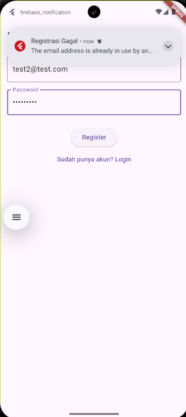
   
  <em>Contoh notifikasi jika registrasi gagal.</em>

**3. Manajemen Data Barang (CRUD)**

  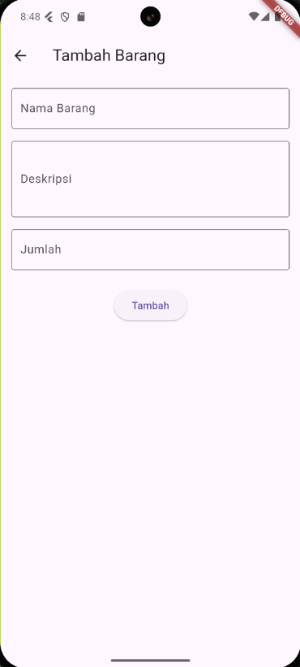
   
  <em>Form untuk menambahkan data barang baru.</em>

  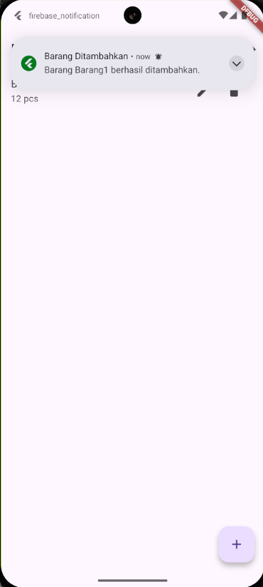
   
  <em>Notifikasi sukses setelah barang baru ditambahkan.</em>

  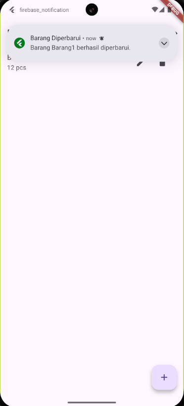
   
  <em>Notifikasi yang memberitahukan data barang telah berhasil diubah.</em>

  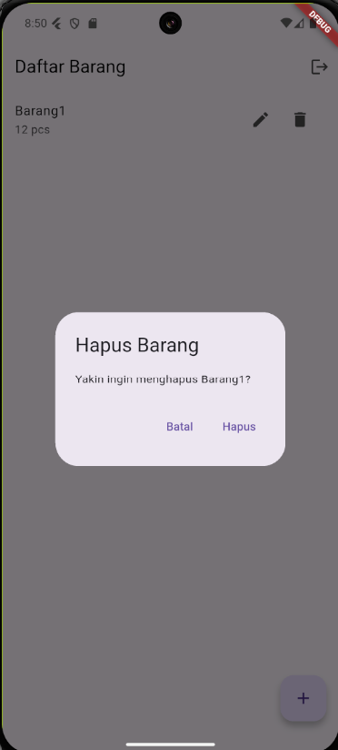
   
  <em>Dialog konfirmasi sebelum menghapus data barang.</em>

  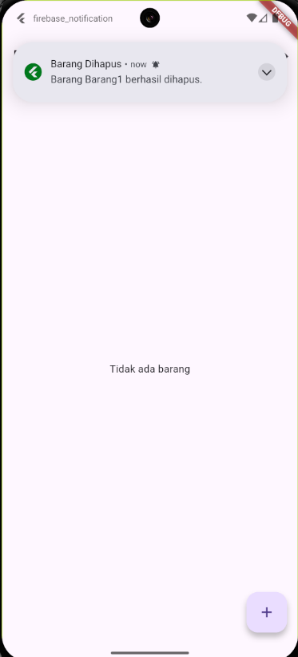
   
  <em>Notifikasi sukses setelah barang berhasil dihapus.</em>

---
## Teknologi yang Digunakan

* **Flutter**: Framework UI untuk membangun aplikasi dari satu basis kode.
* **Firebase**:
    * Firebase Authentication: Untuk manajemen pengguna.
    * Cloud Firestore: Untuk penyimpanan data barang.
* **Awesome Notifications**: Library Flutter untuk membuat notifikasi lokal yang kaya fitur.
* **Bahasa Pemrograman**: Dart

---
